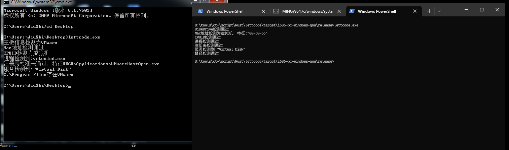

# FuckVM
Rust Fuck VM

Tencent2016_PC这个反虚拟机工具用Rust重写了一份，顺便总结了一下技巧    
````
 1.检测MAC地址开头是否是:00-0C-29-92-EB,00-05-69,00-0c-29,00-50-56
2.汇编调用CPUID指令，调用前先设置EAX=1：处理器信息和功能位,获取8位，检测如果不是0测为虚拟机 (WIKI:https://en.wikipedia.org/wiki/CPUID
3.通过WMI查询win32_DiskDrive里的Caption是否存在VMware
4.进程检测是否存在vmtoolsd.exe
5.注册表特征HKCU\Applications\VMwareHostOpen.exe
6.检测服务注释是否存在Virtual Disk
7.检测C:\\Program Files\\VMware\\路径是否存在
8.检测内存条序列号是否位空，型号是否显示不为win32_开头 (没写)
9.开机时间检测 (没写)
````
    


自行编译
````
安装主工具链
rustup component add rust-src --toolchain nightly

安装x64工具链
rustup toolchain install nightly-x86_64-pc-windows-gnu
rustup target add x86_64-pc-windows-gnu

安装x86工具链
rustup toolchain install i686-pc-windows-gnu
rustup target add i686-pc-windows-gnu

切换至x64
rustup default x86_64-pc-windows-gnu
rustup set default-host x86_64-pc-windows-gnu

切换至x86
rustup default i686-pc-windows-gnu
rustup set default-host i686-pc-windows-gnu

编译
cargo +nightly build -Z build-std=std,panic_abort -Z build-std-features=panic_immediate_abort --target x86_64-pc-windows-gnu --release #x64
cargo +nightly build -Z build-std=std,panic_abort -Z build-std-features=panic_immediate_abort --target i686-pc-windows-gnu --release #x86
````
